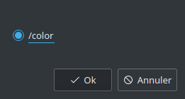

# Overview
This package contains a Qt RViz panel that allows users to draw graphs of topics values dynamically.

Supported built-in types are:
- bool
- duration
- float32
- float64
- int8
- int16
- int32
- int64
- time
- uint8
- uint16
- uint32
- uint64

:warning: It is not possible to draw graphs from values inside custom messages, see https://gitlab.com/InstitutMaupertuis/graph_rviz_plugin/issues/11

# Screenshot

:information_source: The panel configuration is saved/loaded in the RViz configuration file, this includes which topics are recorded, the graph settings and settings.

# User manual

## Start / pause
Allows to start recording or pause the recording. When paused, it is possible to inspect the graph and the data are still updated in the background (pausing does not make you loose data).

## Stop
Stop a recording, no data will be recorded anymore.

## Topics
Allows to choose which topics to record. Cannot be modified when started or paused.

## Graph settings
Allows to change the appearance of each graph.

- Display: Whether to display the graph or not (this does not affect the data update in the background).
- Color: The color of the graph line.
- Thickness: The thickness of the graph line.

## Settings
Allow to change the panel configuration

- Refresh frequency: At what rate the graph updates, you can lower the graph update if performance becomes a problem.
- Enabled legend: Show or hide the legend.
- Y axis
  - Y auto: The Y axis will be automatically scaled depending on the topics values (hidden topics are included in the scaling).
  - Y max / Y min: Allows to specify a fixed Y range.
- X axis window time: If enabled, the graph will only show the latest `x` data depending on the time value.

## Export
Allows to export the graph to a PNG, PDF or JPEG file.

## Reset
Clears the graphs, underlying data and topics to be recorded.
